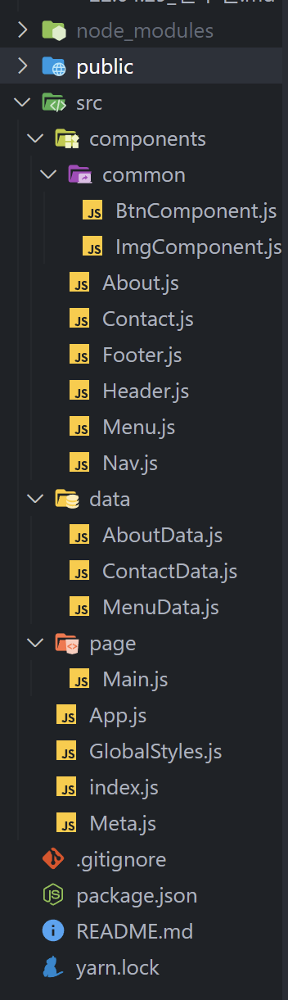

# REACT - W3 Schools Clone

## 전우열 과제

> 2022-04-29

## 파일 구성



## DOM 구조


## 레이아웃


<hr/>

## src/index.js

```javascript
/**
 * @filename: index.js
 * @description: 프로그램 시작점
 * @author: JEON WOO YEOL
 */

import React from 'react';
import ReactDOM from 'react-dom/client';
import App from './App';

// 라우팅 처리
import { BrowserRouter } from 'react-router-dom';

// 메타태그 설정
import Meta from './Meta';

// 글로벌 스타일 설정
import GlobalStyles from './GlobalStyles';

const root = ReactDOM.createRoot(document.getElementById('root'));
root.render(
  <React.StrictMode>
    <div>
      {/* 글로벌 스타일 설정 */}
      <GlobalStyles />

      {/* 메타태그 설정 */}
      <Meta />

      {/* 라우팅 처리 */}
      <BrowserRouter>
        <App />
      </BrowserRouter>
    </div>
  </React.StrictMode>,
);
```

<hr/>

## src/App.js

```javascript
/**
 * @filename: App.js
 * @description: 컴포넌트 정의
 * @author: JEON WOO YEOL
 */

import React from 'react';
import { Route, Routes } from 'react-router-dom';
import styled from 'styled-components';

import Nav from './components/Nav';
import Header from './components/Header';
import Footer from './components/Footer';

import Main from './page/Main';

const AppContainer = styled.div`
  display: flex;
  flex-direction: column;
  justify-content: center;
  align-items: center;
  width: 1100px;
  margin: 0 auto;

  hr {
    width: 100%;
    border: 0;
    border-top: 1px solid #eee;
    margin: 20px 0;
  }
`;

const App = () => {
  return (
    <div>
      {/* NAV 컴포넌트 */}
      <Nav />

      <AppContainer>
        {/* Header 컴포넌트 */}
        <Header />

        <Routes>
          {/* Main 컴포넌트 */}
          <Route path="/" export={true} element={<Main />} />
        </Routes>
      </AppContainer>

      {/* Footer 컴포넌트 */}
      <Footer />
    </div>
  );
};

export default App;
```

## src/GlobalStyles.js

```javascript
/**
 * @filename: GlobalStyles.js
 * @description: 전역 스타일 시트
 * @author: JEON WOO YEOL
 */
import { createGlobalStyle } from 'styled-components';

const GlobalStyles = createGlobalStyle`
    * {
      box-sizing: border-box;
      margin: 0;
      padding: 0;
    }

    body {
      font-family: "Times New Roman", Georgia, serif;
      font-size: 15px;  
      line-height: 1.5;
    }

    .title {
      font-family: sans-serif;
      font-weight: 400;
      font-size: 36px;
      line-height: 54px;
      letter-spacing: 5px;
      margin: 10px auto 10px;
    }

    .subTitle {
      font-family: sans-serif;
      font-weight: 400;
      font-size: 18px;
      line-height:27px;
      letter-spacing: 5px;
      margin: 10px 0;
    }

    a {
      color:#000;
      text-decoration: none;
      outline: none;
  
      &:hover, &:active {
        text-decoration: none; color:#000;
      }
    }
`;

export default GlobalStyles;
```

## src/Meta.js

```javascript
/**
 * @filename: Meta.js
 * @description: SEO 처리, 웹폰트 적용
 * @author: JEON WOO YEOL
 */

import React from 'react';
import { Helmet, HelmetProvider } from 'react-helmet-async';

const Meta = (props) => {
  return (
    <HelmetProvider>
      <Helmet>
        {/* SEO */}
        <meta charSet="utf-8" />
        <title>{props.title}</title>
        <meta name="description" content={props.description} />
        <meta name="keywords" content={props.keywords} />
        <meta name="author" content={props.author} />
        <meta property="og:type" content="website" />
        <meta property="og:title" content={props.title} />
        <meta property="og:description" content={props.description} />
        <meta property="og:url" content={props.url} />

        {/* 웹폰트 */}
        <link rel="preconnect" href="https://fonts.googleapis.com" />
        <link rel="preconnect" href="https://fonts.gstatic.com" crossorigin />
        <link
          href="https://fonts.googleapis.com/css2?family=Playfair+Display&display=swap"
          rel="stylesheet"
        ></link>
      </Helmet>
    </HelmetProvider>
  );
};

/* 기본값 */
Meta.defaultProps = {
  title: 'W3 Clone Coding',
  description: 'React.js로 구현한 W3School 클론코딩 페이지 입니다.',
  keywords: 'React,layout,demo',
  author: 'JEON WOO YEOL',
  url: window.location.href,
};

export default Meta;
```

<hr/>

## src/page/Main.js

```javascript
import React from 'react';
import About from '../components/About';
import Menu from '../components/Menu';
import Contact from '../components/Contact';

const Main = () => {
  return (
    <div>
      {/* About 컴포넌트 */}
      <About title="About Catering" subTitle="Tradition since 1889" />
      <hr />

      {/* Menu 컴포넌트 */}
      <Menu title="Our Menu" />
      <hr />

      {/* Contact 컴포넌트 */}
      <Contact title="Contact" />
    </div>
  );
};

export default Main;
```

<hr/>

## src/components/About.js

```javascript
import React from 'react';
import styled from 'styled-components';
import AboutData from '../data/AboutData';
import ImgComponent from './common/ImgComponent';

const AboutContainer = styled.div`
  display: flex;
  justify-content: center;
  align-items: flex-start;
  width: 1100px;
  padding: 64px 0;
  margin: 0 auto;

  .aboutText {
    display: flex;
    flex-direction: column;
    justify-content: center;
    align-items: center;
    width: 50%;
    padding: 12px 24px;

    .aboutDesc {
      font-size: 18px;
      line-height: 27px;
      margin-top: 18px;

      .seasonal {
        color: #000;
        background-color: #f1f1f1;
        font-size: 18px;
        line-height: 1.5;
        padding: 0 8px;
      }
    }
  }
`;

/* 데이터를 받아와서 컴포넌트 생성 */
const AboutContent = ({ desc, index }) => {
  // 스크립팅 공격에 취약한 방법
  let codes = 'We only use <span class="seasonal">seasonal</span> ingredients.';

  return (
    <p className="aboutDesc">
      {desc}
      {index === 0 ? (
        <span dangerouslySetInnerHTML={{ __html: codes }}></span>
      ) : (
        ''
      )}
    </p>
  );
};

const About = ({ title, subTitle }) => {
  const aboutSrc = 'https://www.w3schools.com/w3images/tablesetting2.jpg';

  return (
    <AboutContainer>
      {/* 이미지 영역 */}
      <ImgComponent src={aboutSrc} alt="menuImage" />

      {/* 텍스트영역 */}
      <div className="aboutText">
        <h1 className="title">{title}</h1>
        <br />
        <h5 className="subTitle">{subTitle}</h5>

        {/* 데이터를 받아와서 컴포넌트 생성 */}
        {AboutData.map((v, i) => {
          return <AboutContent key={i} desc={v.desc} index={i} />;
        })}
      </div>
    </AboutContainer>
  );
};

export default About;
```

## src/components/Menu.js

```javascript
import React from 'react';
import styled from 'styled-components';
import ImgComponent from '../components/common/ImgComponent';
import MenuData from '../data/MenuData';

const MenuContainer = styled.div`
  display: flex;
  justify-content: center;
  align-items: flex-start;
  width: 1100px;
  padding: 64px 0;
  margin: 0 auto;

  .menuText {
    display: flex;
    flex-direction: column;
    justify-content: center;
    align-items: flex-start;
    width: 50%;
    padding: 12px 24px;

    .menuTitle {
      font-family: sans-serif;
      font-size: 20px;
      font-weight: 400;
      line-height: 30px;
      letter-spacing: 5px;
      margin: 10px 0;
    }

    .menuDesc {
      color: #757575;
      font-size: 15px;
      line-height: 22.5px;
      margin: 15px 0;
    }
  }
`;

const MenuContent = ({ menuTitle, menuDesc }) => {
  return (
    <div>
      <h4 className="menuTitle">{menuTitle}</h4>
      <p className="menuDesc">{menuDesc}</p>
      <br />
    </div>
  );
};

const Menu = ({ title }) => {
  const menuSrc = 'https://www.w3schools.com/w3images/tablesetting.jpg';

  return (
    <MenuContainer>
      {/* 텍스트영역 */}
      <div className="menuText">
        <h1 className="title">{title}</h1>
        <br />

        {/* 데이터를 받아와서 컴포넌트 생성 */}
        {MenuData.map((v, i) => {
          return <MenuContent key={i} menuTitle={v.title} menuDesc={v.desc} />;
        })}
      </div>

      {/* 이미지영역 */}
      <ImgComponent src={menuSrc} alt="menuImage" />
    </MenuContainer>
  );
};

export default Menu;
```

## src/components/Contact.js

```javascript
import React from 'react';
import styled from 'styled-components';
import ContactData from '../data/ContactData';
import BtnComponent from './common/BtnComponent';

const ContactContainer = styled.div`
  display: flex;
  flex-direction: column;
  justify-content: center;
  align-items: flex-start;
  width: 1100px;
  padding: 64px 16px;
  margin: 0 auto;

  .title {
    margin: 10px 0;
  }

  .contactDesc {
    font-size: 15px;
    line-height: 22.5px;
    margin-top: 15px;

    b {
      font-size: 18px;
      line-height: 27px;
      color: #607d8b;
    }
  }

  .contactForm {
    width: 100%;
    line-height: 22.5px;

    p {
      margin: 15px 0;
      font-family: Arial, sans-serif;
      font-size: 15px;

      input {
        display: block;
        width: 100%;
        padding: 16px 8px;
        border: none;
        border-bottom: 1px solid #ccc;
        line-height: 22.5px;
      }
    }
  }
`;

const Contact = ({ title }) => {
  const { desc, addr, email } = ContactData;

  return (
    <ContactContainer>
      <h1 className="title">{title}</h1>
      <br />

      <div>
        <p className="contactDesc">{desc}</p>
        <p className="contactDesc">
          <b>{addr}</b>
        </p>
        <p className="contactDesc">{email}</p>
      </div>

      {/* 폼영역 */}
      <form className="contactForm">
        <p>
          <input type="text" placeholder="Name" />
        </p>
        <p>
          <input type="number" placeholder="How many people" />
        </p>
        <p>
          <input type="datetime-local" placeholder="Date and time" />
        </p>
        <p>
          <input type="text" placeholder="Message \ Special requirements" />
        </p>
        <p>
          <BtnComponent name="SEND MESSAGE" />
        </p>
      </form>
    </ContactContainer>
  );
};

export default Contact;
```

## src/components/Nav.js

```javascript
import React from 'react';
import { Link } from 'react-router-dom';
import styled from 'styled-components';

const NavContainer = styled.div`
  position: fixed;
  top: 0;
  left: 0;
  z-index: 1;
  display: flex;
  justify-content: flex-start;
  align-items: center;
  width: 100%;
  padding: 8px 16px;
  color: #000;
  background-color: #fff;
  box-shadow: 0 2px 5px 0 rgb(0 0 0 / 16%), 0 2px 10px 0 rgb(0 0 0 / 12%);
  line-height: 23px;
  letter-spacing: 4px;

  .logo {
    a {
      padding: 8px 16px;
    }
  }

  .nav {
    margin-left: auto;

    a {
      display: inline-block;
      border: none;
      padding: 8px 16px;
    }
  }
`;

const Nav = () => {
  return (
    <NavContainer>
      <div className="logo">
        <Link to="/">Gourmet au Catering</Link>
      </div>

      <nav className="nav">
        <Link to="/about">About</Link>
        <Link to="/menu">Menu</Link>
        <Link to="/contact">Contact</Link>
      </nav>
    </NavContainer>
  );
};

export default Nav;
```

## src/components/Header.js

```javascript
import React from 'react';
import styled from 'styled-components';

const HeaderContainer = styled.div`
  position: relative;

  .headerImg {
    width: 1600px;
    height: 800px;

    img {
      display: block;
      width: 100%;
    }
  }

  .headerTitle {
    position: absolute;
    left: 0;
    bottom: 0;
    padding: 12px 24px;
    opacity: 0.6;

    h1 {
      font-family: sans-serif;
      font-weight: 400;
      margin: 10px auto 10px;
      font-size: 36px;
      font-weight: 400;
      line-height: 54px;
      letter-spacing: 5px;
    }
  }
`;

const Header = () => {
  return (
    <HeaderContainer>
      <div className="headerImg">
        
      </div>

      <div className="headerTitle">
        <h1>Le Catering</h1>
      </div>
    </HeaderContainer>
  );
};

export default Header;
```

## src/components/Footer.js

```javascript
import React from 'react';
import { Link } from 'react-router-dom';
import styled from 'styled-components';

const FooterContainer = styled.footer`
  width: 100%;
  padding: 32px 0;
  background-color: #f1f1f1;
  color: #000;
  text-align: center;

  p {
    margin: 15px 0;
    line-height: 22.5px;

    a {
      text-decoration: underline;
      color: inherit;
    }
  }
`;

const Footer = () => {
  return (
    <FooterContainer>
      <p>
        Powered by&nbsp;
        <Link to="/">w3.css</Link>
      </p>
    </FooterContainer>
  );
};

export default Footer;
```

<hr/>

## src/components/common/ImgComponent.js

```javascript
import React from 'react';
import styled from 'styled-components';

const ImgComponentStyle = styled.div`
  width: 50%;
  padding: 12px 24px;

  img {
    display: block;
    width: 100%;
    opacity: 0.75;
  }
`;

const ImgComponent = ({ src, alt }) => {
  return (
    <ImgComponentStyle>
      
    </ImgComponentStyle>
  );
};

export default ImgComponent;
```

## src/components/common/BtnComponent.js

```javascript
import React from 'react';
import styled from 'styled-components';

const BtnContainer = styled.button`
  display: inline-block;
  border: none;
  padding: 8px 16px;
  margin: 16px 0;
  font-size: 15px;
  line-height: 22.5px;
  text-align: center;
  font-family: 'Times New Roman', Georgia, serif;
  cursor: pointer;
`;

const BtnComponent = ({ name }) => {
  return <BtnContainer>{name}</BtnContainer>;
};

export default BtnComponent;
```

<hr/>

## src/data/AboutData.js

```javascript
const AboutData = [
  {
    desc: `The Catering was founded in blabla by Mr. Smith in lorem ipsum dolor
    sit amet, consectetur adipiscing elit consectetur adipiscing elit, sed
    do eiusmod tempor incididunt ut labore et dolore magna aliqua. Ut enim
    ad minim veniam, quis nostrud exercitation ullamco laboris nisi ut
    aliquip ex ea commodo consequat. Duis aute iruredolor in reprehenderit
    in voluptate velit esse cillum dolore eu fugiat nulla pariatur.
    `,
  },
  {
    desc: `Excepteur sint occaecat cupidatat non proident, sunt in culpa qui
    officia deserunt mollit anim id est laborum consectetur adipiscing
    elit, sed do eiusmod temporincididunt ut labore et dolore magna
    aliqua. Ut enim ad minim veniam, quis nostrud exercitation ullamco
    laboris nisi ut aliquip ex ea commodo consequat.`,
  },
];

export default AboutData;
```

## src/data/ContactData.js

```javascript
const ContactData = {
  desc: `We offer full-service catering for any event, large or small. We
    understand your needs and we will cater the food to satisfy the biggerst
    criteria of them all, both look and taste. Do not hesitate to contact
    us.`,
  addr: `Catering Service, 42nd Living St, 43043 New York, NY`,
  email: ` You can also contact us by phone 00553123-2323 or email
  catering@catering.com, or you can send us a message here:`,
};

export default ContactData;
```

## src/data/MenuData.js

```javascript
const MenuData = [
  {
    title: 'Bread Basket',
    desc: 'Assortment of fresh baked fruit breads and muffins 5.50',
  },
  {
    title: 'Honey Almond Granola with Fruits',
    desc: 'Natural cereal of honey toasted oats, raisins, almonds and dates 7.00',
  },
  {
    title: 'Belgian Waffle',
    desc: 'Vanilla flavored batter with malted flour 7.50',
  },
  {
    title: 'Scrambled eggs',
    desc: 'Scrambled eggs, roasted red pepper and garlic, with green onions 7.50',
  },
  {
    title: 'Blueberry Pancakes',
    desc: 'With syrup, butter and lots of berries 8.50',
  },
];

export default MenuData;
```

<hr/>

## 후기

```
- 그동안의 연습문제 내용을 클론코딩에 적용해보는 시간을 가질 수 있어서 좋았습니다.
- 반복되는 부분을 리액트로 처리할 수 있어서 편했습니다.
- 재사용 가능한 컴포넌트를 어느 정도까지 만들지를 고민해봐야겠습니다.
- 추후에 JSON 안에 태그가 있을 때 파싱하는 방법을 찾아봐야겠습니다.
```
